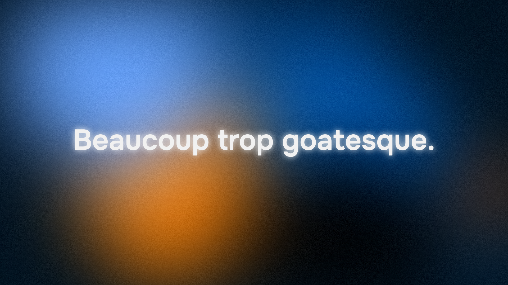

# 🦋 Le Village Numérique Résistant



> **Projet pour la Nuit de l'Info 2025** — 4 & 5 Décembre 2025

## 🏆 Équipe

**Beaucoup trop goatesque** 🐐  
IUT A — Toulouse

### Membres

- **Kilian GUERIN**
- **Tom TESTU**
- **Timéo GOSGNACK**
- **Luka CHABOT**
- **Soraya IYANGUI**
- **Kohaina ATEO**

---

## 🎯 Le Projet

### Concept : David vs Goliath 2.0

L'Empire des Big Tech impose l'obsolescence programmée. Avec la fin de Windows 10, des millions de PC risquent d'être jetés.

**Notre mission :** Promouvoir la démarche **NIRD** (Numérique Inclusif, Responsable et Durable) auprès des établissements scolaires.

### La Solution

- 🐧 **Linux** — Systèmes d'exploitation libres et légers
- ♻️ **Réemploi** — Donner une seconde vie aux vieux PC
- 🔓 **Logiciels Libres** — Alternatives éthiques et gratuites
- 🛡️ **Souveraineté** — Vos données restent les vôtres

---

## 🚀 Lancer le projet

### Prérequis

- Node.js (v18+)
- npm

### Installation

```bash
# Cloner le projet
git clone <repo-url>
cd village-numerique-resistant

# Installer les dépendances
npm install

# Lancer en développement
npm run dev
```

L'application sera disponible sur `http://localhost:3000`

### Build

```bash
npm run build
npm run preview
```

---

## 🛠️ Stack Technique

- **React 19** + **TypeScript**
- **Vite** — Build tool ultra-rapide
- **Tailwind CSS** — Styling utilitaire
- Animations CSS personnalisées

---

## 📁 Structure

```
├── components/          # Composants React
│   ├── HeroContent.tsx
│   ├── ComponentsSection.tsx
│   ├── FeedbacksSection.tsx
│   ├── SloganSection.tsx
│   └── NirdButton.tsx   # Bouton custom avec effet glitch
├── img/                 # Assets (logos)
├── App.tsx              # Composant principal
├── index.tsx            # Point d'entrée
└── index.html
```

---

## 🔗 Liens

- [Site officiel NIRD](https://nird.forge.apps.education.fr/)
- [Nuit de l'Info](https://www.nuitdelinfo.com/)

---

## 📜 Licence

Projet open source — Libre comme Linux 🐧

---

<div align="center">

**Liberté. Égalité. Sobriété.** ✊

*Ne laissez pas l'Empire gagner. Passez au NIRD.*

</div>
